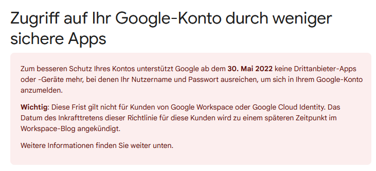

## mailsender

# Spring boot mail sender example

This is a Spring Boot mail sending exemplary application.

# NOTE

This API will currently throw an error during email sending!

As of 30 May Google blocked 3rd-party smtp api use (see picture below) which was configured with this application.

Thus, this application needs to be connected to different SMTP server. The plan is to use Amazon SES.

https://aws.amazon.com/de/ses/pricing/
https://aws.amazon.com/ses/

__It was however deployed beforehand and is still accessible here:__ 
(it will still throw an error because of refused connection to smtp server - working on that 🏗️)

👉  [m4ilsender.herokuapp.com/](m4ilsender.herokuapp.com/)

# TODO

- Configure Amazon SES service and connect it with this application
- add cache to mail sending to disable appliation missuse 